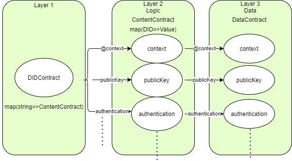

1.	考虑到需要升级，则存储和控制需要相分离；
2.	考虑到需要升级，如果OND ID document的属性增加了，怎么在合约中增加一类存储；
3.	Solidity的struct不允许嵌套self，那么group该怎么定义？
4.	可以采用linked event的形式存储ONT ID的document；

# UID Discovery 设计文档 —— solidity实现

## 当前ONT ID的document结构

```json
{
  "@context": ["https://www.w3.org/ns/did/v1", "https://ontid.ont.io/did/v2"]
  "id": "did:ont:AderzAExYf7yiuHicVLKmooY51i2Cdzg72",
  "publicKey": [{...}],
  "authentication": [{...}],
  "controller": {...},
  "recovery": {...},
  "service": [{...}],
  "attribute": [{...}],
  "created": {...},
  "updated": {...},
  "proof": {...}
}
```

## 三层合约体系



### Layer 1

以mapping形式存储ONT ID的各个字段，key是属性的名字，value是每本属性合约的地址。

```solidity
contract DIDContract {
    mapping(string => ContentContract) public contents;
}
```

### Layer 2

ONT ID document的每个属性都由一本合约来实现，或者多个属性可以由同一本合约管理（为了减少合约数量）。属性合约继承自共同的父类。

```solidity
contract ContentContract {
    mapping(string => DataContract) public didData; // store each DID data
    function add() public;
    function remove() public;
    ...
}
```

### Layer 3

数据存储层，每本属性合约有独立的数据存储合约。数据的存储格式为bytes，序列化方式为Ontology ZeroCopy。

```solidity
contract DataContract {
    function put(bytes key, bytes value) public;
    function get(bytes key) public;
}
```

## 合约升级

### document字段升级

这意味着document字段发生了改变，字段可能会变多，也可能会删减。

这种情况下我们升级Layer 1的合约即可。可以整个合约升级，也可以直接修改contents字段，增加/删除属性合约。

### 属性规则升级

直接升级Layer 2对应的合约。由于数据都是不变的，所以修改逻辑层即可。这里要考虑新旧版本的数据的兼容问题，即新协议要兼容老数据。

## Group实现

用Ontology ZeroCopy的bytes即可。

## Linked Event

使用event链表存储每次document的更新，这样可以很方便的追溯。合约中存的始终都是最新的document，当然在合约中也可以不存，这样就只有event里面有document了。